# okta-saml-spring-boot

A Spring Boot application combining standard database authentication with SAML 2.0 authentication via Okta ( https://www.okta.com/ )

## Introduction

**Spring Boot** is a very common and well-supported suite of tools for developing web applications in Java. **Database 
authentication**, in which credentials identifying authorized users are stored in a database accessible by the application,
is maybe the most common and simple method of authenticating users. **SAML** is a well-supported and open standard for 
handling authentication between identity providers and service providers.

Combining Spring Boot and database authentication is a common topic, and examples are easy to come by. Combining Spring
Boot and SAML authentication is also well-documented, with very simple configuration options available as in [this example
from the Okta blog](https://developer.okta.com/blog/2017/03/16/spring-boot-saml).

However, what if you want to combine both database and SAML authentication methods within the same Spring Boot application,
so a user can be authenticated using either method? We will discuss and implement a solution here!

## Acknowledgment
Much of the groundwork for the implementation of SAML 2.0 authentication used in this project was developed by
[Vincenzo De Notaris](https://github.com/vdenotaris) and can be found in 
[this project on GitHub](https://github.com/vdenotaris/spring-boot-security-saml-sample). For this project, some changes
have been made to support dual DB+SAML authentication, and to use Okta as the SAML IDP rather than SSOCircle.

## Walkthrough

### Why SAML? Why Okta?

There are a number of benefits to using SAML to handle authentication for your application:
* **Loose coupling between your application and your authentication mechanism** increases independence
between the two, allowing for more rapid development/evolution of application logic with less risk
of regression
* **Shifts the responsibility of authentication**, which involves storing and retrieving sensitive user information,
to the Identity Provider (e.g. Okta) which will almost always offer less risk since identity management **is** their
business model
* Allows for an **improved user experience** via Single Sign-On while navigating between multiple apps

**Okta is a very well-established identity provider with robust features and a wealth of support.** Managing users,
accounts, and permissions with Okta is simple and straightforward while still flexible and extensible enough to support
your application no matter how much it grows (even as it grows into several applications). And the friendly,
growing community is available to answer any questions you may have!

For this tutorial, you will need to sign up for a **FREE** trial account here: https://www.okta.com/free-trial/

Still, maybe to support legacy systems or because you have strange security requirements, you may need to allow
users to authenticate using either SAML or database credentials. The process to combine SAML 2.0 with DB auth in
Spring Boot is what we'll tackle here!

The source code for this tutorial can be found [here](https://gitlab.com/jcavazos/okta-saml-spring-boot). For now we will
just discuss some of the important points, and at the end we'll go step by step to get the application running. 

### The "Pre-Login" Page
We want to have an initial page in which a user will enter their username for login. Depending on the pattern of the username,
we will either direct the user to a standard Username/Password page for authenticating against the database, or direct
them to the SAML auth flow.

#### index.html
```
<!doctype html>
<html
        lang="en"
        xmlns:th="http://www.thymeleaf.org"
        xmlns:layout="http://www.ultraq.net.nz/thymeleaf/layout"
        layout:decorate="~{layout}"
>
<body>
<section layout:fragment="content">
    <h6 class="border-bottom border-gray pb-2 mb-0">Please Log In:</h6>
    <div class="media text-muted pt-3">
        <form action="#" th:action="@{/pre-auth}" th:object="${username}" method="post">
            <p>Username: <input type="text" th:field="*{username}" /></p>
            <p><input type="submit" value="Submit" /></p>
        </form>
        <br/>
        <p th:text="${error}" style="color: red"></p>
    </div>
</section>
<body>
</html>
```

`IndexController.java`
```
@Controller
public class IndexController {

    @GetMapping
    public String index(Model model) {
        model.addAttribute("username", new PreAuthUsername());
        return "index";
    }

    @PostMapping("/pre-auth")
    public String preAuth(@ModelAttribute PreAuthUsername username,
                          Model model,
                          RedirectAttributes redirectAttributes) {
        if (StringUtils.endsWithIgnoreCase(username.getUsername(), Constants.OKTA_USERNAME_SUFFIX)) {
            // redirect to SAML
            return "redirect:/doSaml";
        } else if (StringUtils.endsWithIgnoreCase(username.getUsername(), Constants.DB_USERNAME_SUFFIX)) {
            // redirect to DB/form login
            return "redirect:/form-login?username="+username.getUsername();
        } else {
            redirectAttributes.addFlashAttribute("error", "Invalid Username");
            return "redirect:/";
        }
    }
}
```

Within `IndexController` we are checking whether the username matches a particular pattern.

### SAML Flow
When redirected to the `/doSaml` endpoint, the SAML flow will be initiated by a custom authentication entry point
defined in `WebSecurityConfig.configure(HttpSecurity)`:
```
@Autowired
private SAMLEntryPoint samlEntryPoint;

...

@Override
protected void configure(HttpSecurity http) throws Exception {
    ...
    http
        .httpBasic()
        .authenticationEntryPoint((request, response, authException) -> {
            if (request.getRequestURI().endsWith("doSaml")) {
                samlEntryPoint.commence(request, response, authException);
            } else {
                response.sendRedirect("/");
            }
        });
    ...
}
```

Here we can wee if the requested URL ends with `doSaml`, the request will be handled by the `SamlEntryPoint` defined
in our configuration. This will redirect the user to authenticate via Okta, and will return the user to `/doSaml` upon
completion. To handle this redirect, we will also define a `Controller` to redirect the user following a successful
SAML auth:

```
@Controller
public class SamlResponseController {
    @GetMapping(value = "/doSaml")
    public String handleSamlAuth() {
        Authentication auth = SecurityContextHolder.getContext().getAuthentication();
        LOGGER.info("doSaml auth result: {}", auth);
        if (auth != null) {
            return "redirect:/landing";
        } else {
            return "/";
        }
    }
}
```

At this point, the user should be successfully authenticated with the app!

### Database Flow

If the username matches another pattern, the user will be redirected to a standard-looking form login page:
#### form-login.html
```
<!doctype html>
<html
        lang="en"
        xmlns:th="http://www.thymeleaf.org"
        xmlns:layout="http://www.ultraq.net.nz/thymeleaf/layout"
        layout:decorate="~{layout}"
>
<body>
<section layout:fragment="content">
    <h6 class="border-bottom border-gray pb-2 mb-0">Database Login:</h6>
    <div class="media text-muted pt-3">
        <form action="#" th:action="@{/form-login}" th:object="${credentials}" method="post">
            <p>Username: <input type="text" th:field="*{username}" /></p>
            <p>Password: <input type="password" th:field="*{password}" /></p>
            <p><input type="submit" value="Submit" /></p>
        </form>
        <br/>
        <p th:text="${error}" style="color: red"></p>
    </div>
</section>
<body>
</html>
```

The login submission will be handled by a `Controller` which will call on the
`AuthenticationManager` we have built in `WebSecurityConfig`:

```
@Override
protected void configure(AuthenticationManagerBuilder auth) throws Exception {
    auth.authenticationProvider(dbAuthProvider);
    auth.authenticationProvider(samlAuthenticationProvider);
}
```

`DbAuthProvider` is a custom component which performs standard DB authentication by checking
the supplied password versus a hashed copy in the database:

```
@Component
public class DbAuthProvider implements AuthenticationProvider {
    private final CombinedUserDetailsService combinedUserDetailsService;
    private final PasswordEncoder passwordEncoder;

    ...

    @Override
    public Authentication authenticate(Authentication authentication) throws AuthenticationException {
        if (!StringUtils.endsWithIgnoreCase(authentication.getPrincipal().toString(), Constants.DB_USERNAME_SUFFIX)) {
            // this user is not supported by DB authentication
            return null;
        }

        UserDetails user = combinedUserDetailsService.loadUserByUsername(authentication.getPrincipal().toString());
        String rawPw = authentication.getCredentials() == null ? null : authentication.getCredentials().toString();

        if (passwordEncoder.matches(rawPw, user.getPassword())) {
            LOGGER.warn("User successfully logged in: {}", user.getUsername());
            return new UsernamePasswordAuthenticationToken(
                    user.getUsername(),
                    rawPw,
                    Collections.emptyList());
        } else {
            LOGGER.error("User failed to log in: {}", user.getUsername());
            throw new BadCredentialsException("Bad password");
        }
    }

    @Override
    public boolean supports(Class<?> aClass) {
        return aClass.isAssignableFrom(UsernamePasswordAuthenticationToken.class);
    }
}
```

The above class calls on `CombinedUserDetailsService` which is another custom component providing
an appropriate `UserDetails` object depending on whether the user is authenticated using the database or SAML,
by implementing `UserDetailsService` and `SAMLUserDetailsService` respectively:

```
@Service
public class CombinedUserDetailsService implements UserDetailsService, SAMLUserDetailsService {
    private final UserRepository userRepository;

    ...

    @Override
    public UserDetails loadUserByUsername(String s) throws UsernameNotFoundException {
        StoredUser storedUser = lookupUser(s);
        return new CustomUserDetails(
                AuthMethod.DATABASE,
                storedUser.getUsername(),
                storedUser.getPasswordHash(),
                new LinkedList<>());
    }

    @Override
    public Object loadUserBySAML(SAMLCredential credential) throws UsernameNotFoundException {
        LOGGER.info("Loading UserDetails by SAMLCredentials: {}", credential.getNameID());
        StoredUser storedUser = lookupUser(credential.getNameID().getValue());
        return new CustomUserDetails(
                AuthMethod.SAML,
                storedUser.getUsername(),
                storedUser.getPasswordHash(),
                new LinkedList<>());
    }

    private StoredUser lookupUser(String username) {
        LOGGER.info("Loading UserDetails by username: {}", username);

        Optional<StoredUser> user = userRepository.findByUsernameIgnoreCase(username);

        if (!user.isPresent()) {
            LOGGER.error("User not found in database: {}", user);
            throw new UsernameNotFoundException(username);
        }

        return user.get();
    }
}
```

The resulting `Controller` to handle DB authentication will look like this:

```
@Controller
public class DbLoginController {

    private final AuthenticationManager authenticationManager;

    ...

    @GetMapping("/form-login")
    public String formLogin(@RequestParam(required = false) String username, Model model) {
        ...
    }

    @PostMapping("/form-login")
    public String doLogin(@ModelAttribute DbAuthCredentials credentials,
                          RedirectAttributes redirectAttributes) {
        try {
            Authentication authentication = authenticationManager.authenticate(new UsernamePasswordAuthenticationToken(
                    credentials.getUsername(), credentials.getPassword()));

            if (authentication.isAuthenticated()) {
                SecurityContextHolder.getContext().setAuthentication(authentication);
            } else {
                throw new Exception("Unauthenticated");
            }

            return "redirect:/landing";
        } catch (Exception e) {
            redirectAttributes.addFlashAttribute("error", "Login Failed");
            return "redirect:/form-login?username="+credentials.getUsername();
        }
    }
}
```

When `doLogin()` is called via `POST`, the `AuthenticationManager` we have built in the above steps
will handle the username/password authentication and redirect the user if successful.

## Get Running

#### Step 1
Clone this project

#### Step 2
Sign up for a free trial account at https://www.okta.com/free-trial/ (this is required to create SAML 2.0 applications in Okta)

#### Step 3
Log in to your Okta at `https://my-okta-domain.okta.com`

#### Step 4
Create a new application via `Admin > Applications > Add Application > Create New App` with the following settings:

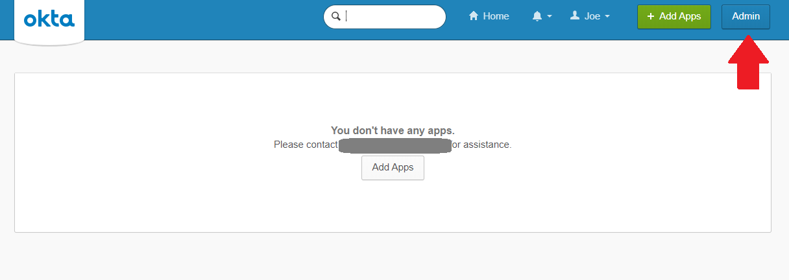

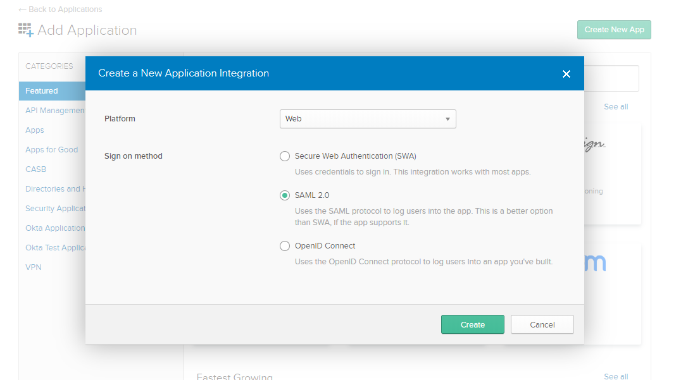

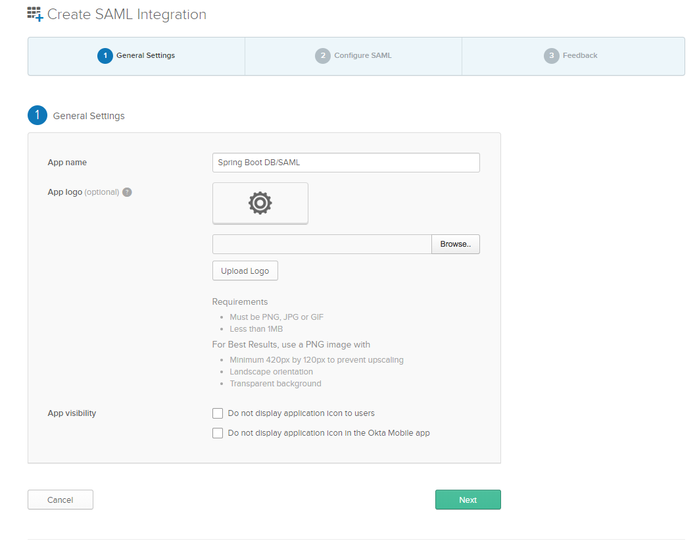


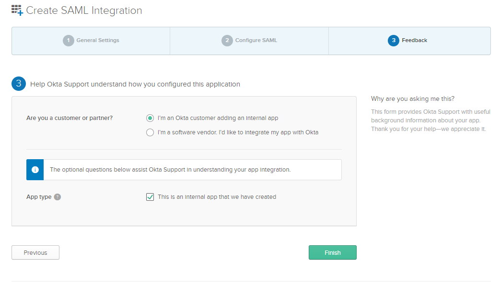

* Platform: `Web`
* Sign On Method: `SAML 2.0`
* App Name: `Spring Boot DB/SAML` (or whatever you'd like)
* Single Sign On URL: `http://localhost:8080/saml/SSO`
* Use this for Recipient URL and Destination URL: `YES`
* Audience URI: `http://localhost:8080/saml/metadata`
* `I'm an Okta customer adding an internal app`
* `This is an internal app that we have created`

#### Step 5
Navigate to `Assignments > Assign to People`

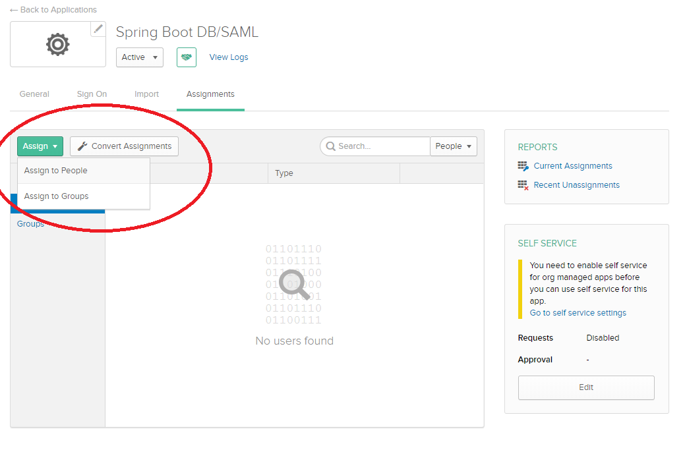

#### Step 6
Assign to your account with the custom username samluser@oktaauth.com


#### Step 7
Navigate to `Sign On > View Setup Instructions` and copy the following values to your `/src/main/resources/application.properties` file
* `saml.metadataUrl` -- Identity Provider Metadata URL
* `saml.idp` -- Identity Provider Issuer

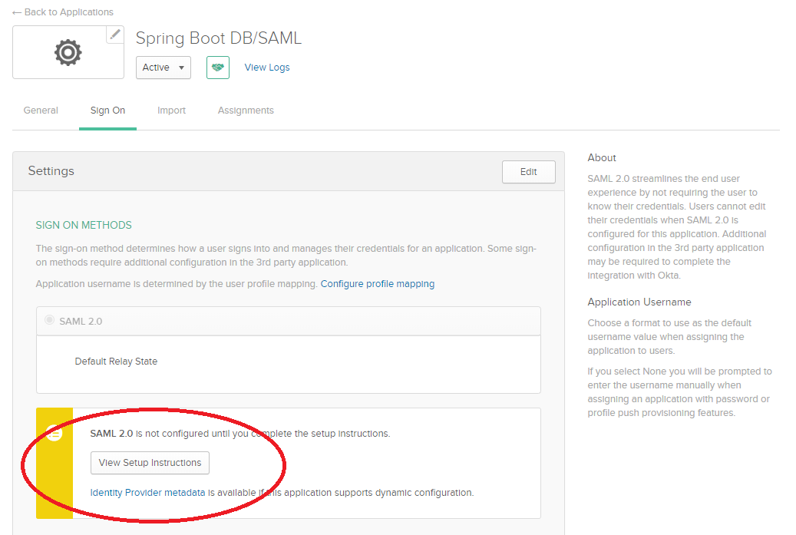

#### Step 8
Run your Spring Boot application in your IDE or via Maven:<br>
`mvn install`<br>
`mvn spring-boot:run`

#### Step 9
Navigate to your application's home page at http://localhost:8080

#### Step 10
* For DB Authentication, log in using `dbuser@dbauth.com / oktaiscool`

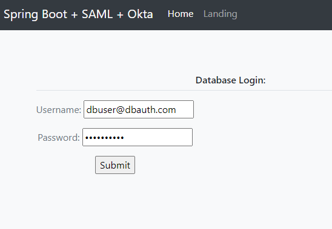

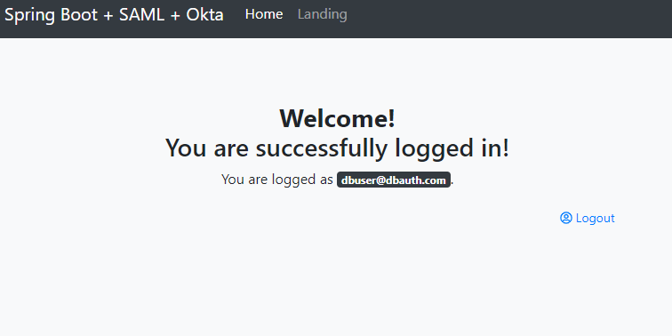

* For SAML/Okta Authentication, log in using `samluser@oktaauth.com`
    * You should be redirected to the SAML/Okta auth flow and returned to your application following successful authentication
    
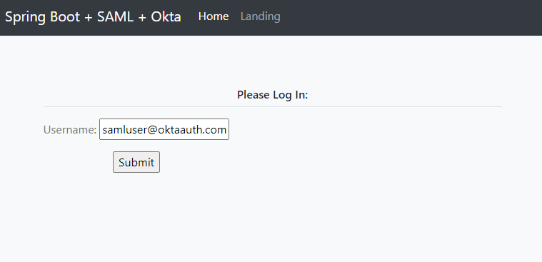

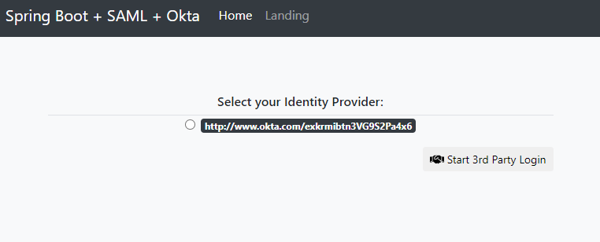

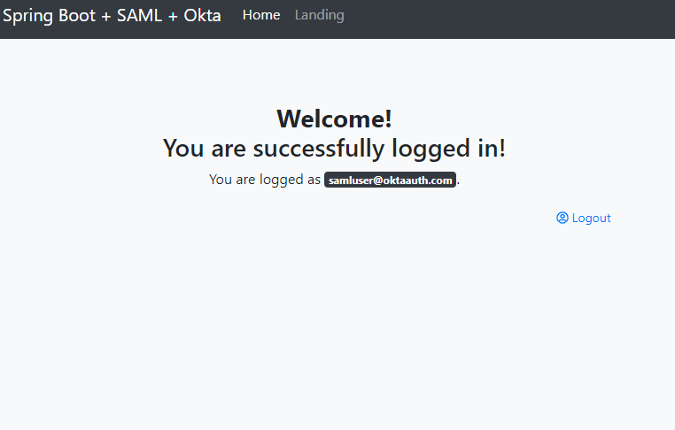